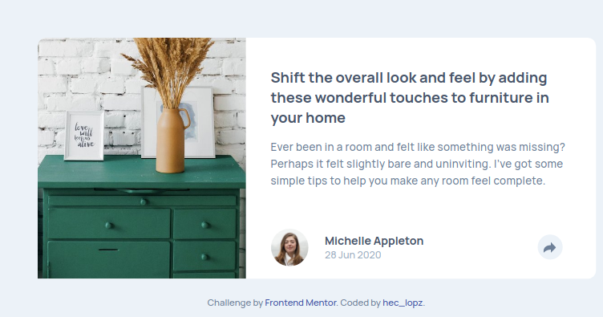

# Article Preview Component | Frontend Mentor Challenge

This is a solution to the [Article preview component challenge on Frontend Mentor](https://www.frontendmentor.io/challenges/article-preview-component-dYBN_pYFT/hub/mobiles-first-using-bem-and-css-animations-vNQQaLn3A).

## Overview

This component shows the preview of a blog entry. It includes cover, title, description and user information. It can be added to a bigger project to show previews.

It was built using HTML and CSS mainly, JavaScript was used to add HTML classes.

### Screenshot

### Installation

You can only clone or download this repository and open the `index.html` file in you browser.

### Links

- Solution URL: [hec-lopz/article-preview-component](https://github.com/hec-lopz/article-preview-component)
- Live Site URL: [Frontend Mentor | Article Preview Component on GH-Pages](https://hec-lopz.github.io/article-preview-component/)

## My process

### Built with

- HTML5
- CSS Flexbox
- CSS Transitions
- JavaScript

### What I learned

Initially I had used CSS animations with the `@keyframe` rule, but I realized that it added complexity to the code and wasn´t really necessary, I switched to CSS Transitions since there were only a few attributes that changed.

I also found out about the `pointer-events` css attribute, it nullifies any event from the box it is on, which means that any text or button won´t react to a click. It was useful here because I can hide the tooltip with opactity instead of using `display:none`, which has higher impact on performance.

## Author

- Website - [hec_lopz](https://heclopz.netlify.app/)
- Frontend Mentor - [@hec-lopz](https://www.frontendmentor.io/profile/hec-lopz)
- Twitter - [@hec_lopz](https://www.twitter.com/hec_lopz)
